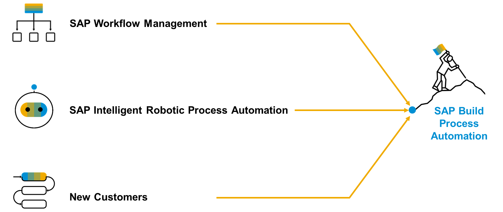

# ♠ 1 [DESCRIBING THE PATH TO SAP BUILD PROCESS AUTOMATION](https://learning.sap.com/learning-journeys/create-processes-and-automations-with-sap-build-process-automation/describing-the-path-to-sap-build-process-automation_b937f72a-1d68-4203-8c88-e5e03c210aa7)

> :exclamation: Objectifs
>
> - [ ] Choisissez le Path approprié pour SAP BPA en fonction du point de départ du client

## :closed_book: LE PATH VERS BUILD PROCESS AUTOMATION

`SAP Build Process Automation (BPA)` est une solution issue des anciens produits SAP autonomes `SAP Workflow Management`[^1] et `SAP Intelligent Robotic Process Automation`[^2]. Elle offre une nouvelle expérience au `citizen developer`[^3], absente de ces deux produits.

Si vous ou votre entreprise avez déjà utilisé `SAP Workflow Management`[^1] ou `SAP Intelligent Robotic Process Automation`[^2], vous recherchez une solution intégrée. Heureusement, SAP Build Process Automation est entièrement compatible avec tous les artefacts de workflow et d'automatisation que vous avez créés.

[Référence - Link Video](https://learning.sap.com/learning-journeys/create-processes-and-automations-with-sap-build-process-automation/describing-the-path-to-sap-build-process-automation_b937f72a-1d68-4203-8c88-e5e03c210aa7)

---

[^1]: SAP Workflow Management est une solution de la SAP Business Technology Platform (SAP BTP) qui permet de modéliser, exécuter, surveiller et optimiser des processus métiers de bout en bout, à travers différents systèmes SAP et non-SAP.
[^2]: SAP Intelligent RPA est une solution proposée par SAP pour automatiser des tâches répétitives et manuelles à l’aide de robots logiciels (bots). Ces bots peuvent interagir avec les interfaces utilisateur comme le ferait un humain, mais plus rapidement, sans erreurs, et 24/7. Depuis fin 2022, SAP Intelligent RPA a été intégré dans SAP Build Process Automation, qui unifie SAP Workflow Management, SAP Business Rules et SAP Intelligent RPA dans une plateforme low-code unique.
[^3]: Un Citizen Developer est un utilisateur métier non-développeur (par exemple, un analyste, un responsable de service ou un employé opérationnel) qui crée ou modifie des applications, des automatisations ou des rapports à l’aide d’outils low-code/no-code fournis par SAP, sans avoir besoin de compétences approfondies en programmation.
