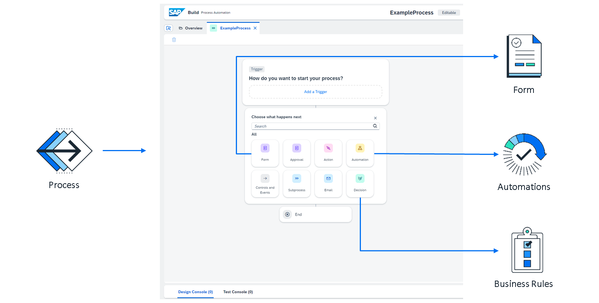
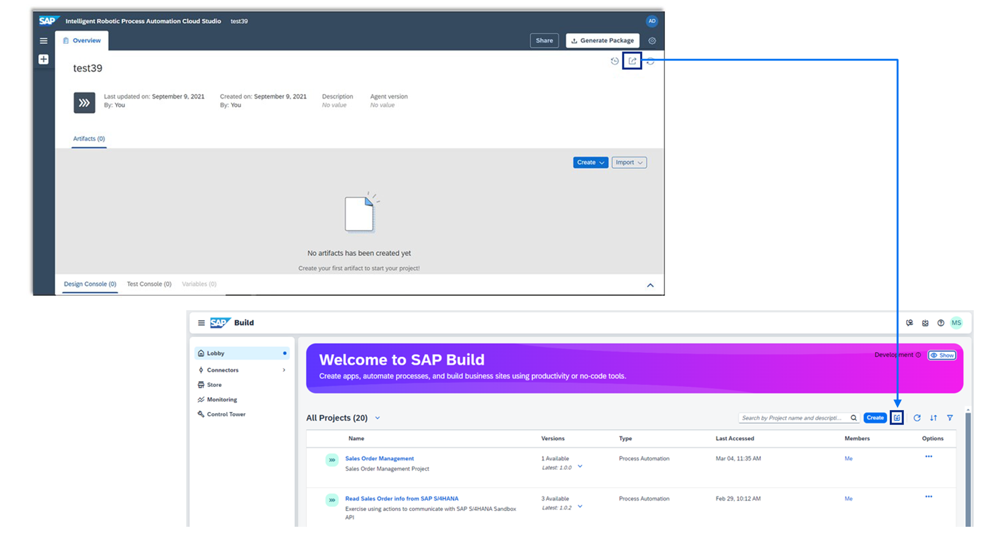
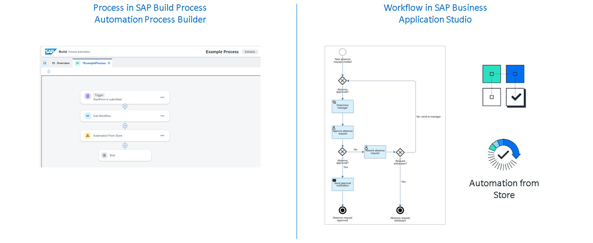

# ♠ 1 [EVALUATING THE DIFFERENT WORKING MODES IN SAP BUILD PROCESS AUTOMATION](https://learning.sap.com/learning-journeys/create-processes-and-automations-with-sap-build-process-automation/evaluating-the-different-working-modes-in-sap-build-process-automation_c106dde3-fa5f-43cb-a576-8feac3dc6174)

> :exclamation: Objectifs
>
> - [ ] Choisissez la manière appropriée de mettre en œuvre une exigence de processus en évaluant les trois modes de travail différents dans SAP Build Process Automation

## :closed_book: SAP BUILD PROCESS AUTOMATION WORKING MODES

Pour créer des processus dans `SAP Build Process Automation`, vous pouvez choisir parmi différents modes de fonctionnement :

- **Importez** des **processus** et des **automatisations prédéfinis** depuis le Store intégré.

- **Créez** des **processus** et des **automatisations personnalisés** de A à Z grâce à l'outil Process Builder.

- **Réutilisez** les **workflows** de `SAP Workflow Management`, que ce soit dans le cadre d'une migration ou lorsque les fonctionnalités de `SAP Build Process Automation` ne répondent pas à tous vos besoins.

- **Réutilisez** les projets d'**automatisation** de `SAP Intelligent Robotic Process Automation` : les projets `SAP Intelligent Robotic Process Automation Cloud Studio` existants sont entièrement compatibles avec `SAP Build Process Automation`.

- Mode **« hybride »** combinant des **processus** et des** workflows prédéfinis**.

### IMPORT OF PREBUILT PROCESSES AND AUTOMATIONS FROM THE BUILT-IN STORE

Cette option vous permet d'utiliser une grande variété de **packages préconfigurés** et directement utilisables, disponibles via le `Store intégré`.

Ces **packages** couvrent tous les secteurs d'activité, tous les secteurs et toutes les fonctions partagées. Leur contenu s'étend des processus métier aux automatisations basées sur des modèles, des modèles de formulaires aux projets de visibilité des processus, en passant par les actions (également appelées compétences).

Il existe également des **packages complets** contenant tous les différents **artefacts**. Ces packages sont généralement prêts à l'emploi et ne nécessitent qu'une configuration minimale. Leur contenu est en constante évolution.

### BUILD OF CUSTOM PROCESSES AND AUTOMATIONS FROM SCRATCH USING THE PROCESSES BUILDER TOOLS

`Process Builder` est l'outil central pour vous, en tant que `citizen developer`, afin de créer vos propres processus et artefacts d'automatisation. Ses fonctionnalités vous permettent de mettre en œuvre la quasi-totalité des scénarios métier sans code. `Process Builder` prend en charge la création et l'utilisation de :

- **Formulaires** et **formulaires d'approbation**

- **Automatisations** (bots)

- **Décisions** (règles métier)

- **Actions** (également appelées compétences)

- **Contrôles**

- **Workflows** développés dans `SAP Business Application Studio`.

### REUSE OF WORKFLOWS FROM SAP WORKFLOW MANAGEMENT

Si vous utilisiez `SAP Workflow Management` avant de migrer vers `SAP Build Process Automation`, vous disposez peut-être de **workflows** existants que vous souhaiteriez réutiliser. `SAP Build Process Automation` permet d'intégrer ces **workflows** à vos processus.

De plus, vous pouvez toujours créer de nouveaux **workflows** dans `SAP Business Application Studio`, puis les déployer sur l'environnement d'exécution de `SAP Build Process Automation`. Cela peut s'avérer utile lorsque vous implémentez des processus complexes, pour lesquels le `Process Builder` sans code de `SAP Build Process Automation` n'offre pas toutes les fonctionnalités requises, ou lorsque vous avez l'habitude de créer vos **workflows** dans `SAP Business Application Studio` et que vous ne souhaitez pas encore migrer complètement vers ce dernier.

### REUSE OF AUTOMATION PROJECTS FROM SAP INTELLIGENT ROBOTICE PROCESS AUTOMATION

Si vous utilisiez `SAP Intelligent Robotic Process Automation` avant de migrer vers `SAP Build Process Automation`, vous disposez peut-être d'investissements en automatisation existants que vous souhaiteriez réutiliser. Vous pouvez exporter vos projets d'automatisation depuis `SAP Intelligent Robotic Process Automation` et les importer dans `SAP Build Process Automation`. `SAP Build Process Automation` offrant les mêmes **artefacts** et outils que `SAP Intelligent Robotic Process Automation Cloud Studio`, vous pouvez désormais gérer et ajuster vos **artefacts** de projet dans `SAP Build Process Automation`.

### "HYBRID" MODE COMBINING PREBUILT, PROCESS AND WORKFLOW CONTENT

`SAP Build Process Automation` offrant une grande flexibilité, vous pouvez également combiner les **artefacts** des modes de fonctionnement mentionnés précédemment, si vous avez des besoins spécifiques ou si vous souhaitez simplement, par exemple, étendre votre **workflow** `SAP Workflow Management` existant avec des étapes supplémentaires dans un processus `SAP Build Process Automation`. Vous pouvez, par exemple, créer un processus qui appelle d'abord un **workflow** développé dans `SAP Business Application Studio`, puis exécute une automatisation importée depuis le Store ou un package développé par un collègue.
